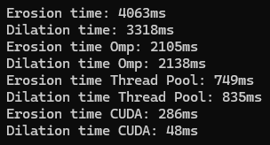

# ErosionDilationSpeedTests
Comparisons of Erosion and Dilation imaging functions running on a CPU, parallelized with Omp and a Thread Pool, and finally with CUDA.

Sample results from an Intel(R) Core(TM) i7-3770K CPU @ 3.50GHz   3.50 GHz CPU, and an NVIDIA Geforce RTX2070 GPU:

